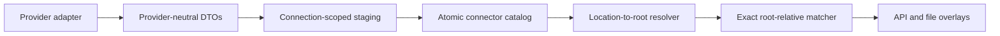

# Architecture Notes

## Backend

- `backend/app/main.py` boots FastAPI, initializes SQLite, and serves the built frontend.
- `backend/app/models/entities.py` contains the normalized schema required for library, format, stream, and scan-job tracking.
- `backend/app/services/scanner.py` performs deterministic discovery and parallel `ffprobe` execution.
- `backend/app/services/connector_contract.py` defines the provider-neutral adapter boundary and DTOs.
- `backend/app/services/connector_sync.py` owns connection-scoped staging, atomic promotion, cancellation, and recovery.
- `backend/app/services/connector_pathing.py` and `connector_matching.py` resolve remote paths to stable root-relative file identities.

## Frontend

- The UI is a small React SPA built with Vite.
- Routing is client-side; the backend serves `index.html` for deep links.
- `frontend/globals.css` provides the design language, extended by `frontend/src/medialyze.css`.

## Data flow

1. A library is created from a browsed path under `MEDIA_ROOT`.
2. A scan job traverses the filesystem and updates `media_files`.
3. New or changed files are analyzed with `ffprobe`.
4. Normalized rows are stored and aggregated for dashboard/detail endpoints.

## Connector data flow

External catalogs use the architecture documented in [connectors.md](connectors.md):

The connector core owns connections, remote catalogs, mappings, synchronization, and matches. Provider adapters own transport and response normalization. The MediaLyze scanner remains the sole owner of local paths and file identities. Jellyfin user, playback, and image data remain provider-specific compatibility extensions during the first connector release.
