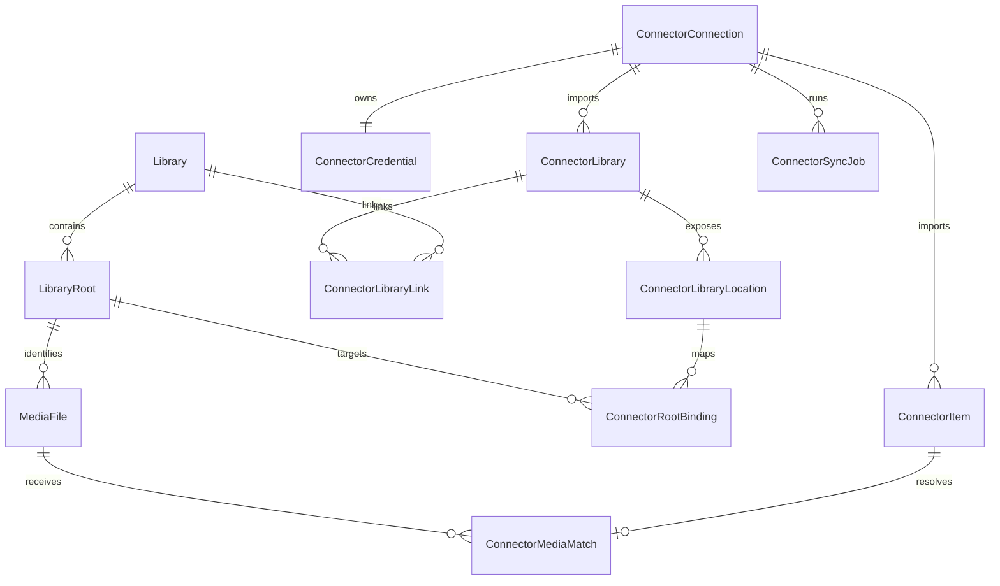
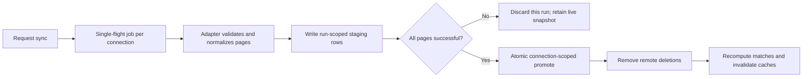

# Connector architecture

MediaLyze imports external media-server catalogs through a provider-neutral connector layer. Jellyfin is the first adapter. Plex and other providers must integrate through the same adapter contract; provider code must not read, rewrite, or derive `MediaFile` paths directly.

The physical identity of a local file is always:

```text
LibraryRoot.id + MediaFile.relative_path
```

Names shown in the UI are derived from the editable `LibraryRoot.display_name` and the relative path. They are never persisted as file identity.

## Entity model



The staging tables `connector_sync_stage_libraries`, `connector_sync_stage_locations`, and `connector_sync_stage_items` are isolated by both `connection_id` and `sync_run_id`. They are not public catalog tables.

## Invariants

- A provider is an extensible lowercase string, not a database enum.
- `(provider, name)` uniquely identifies a connection. Multiple connections of one provider are allowed.
- `(connection_id, remote_id)` uniquely identifies a remote library or item.
- A connector item has zero or one match. A local file may receive any number of matches, including several items from one server and items from different providers.
- Library links are optional and many-to-many. They provide logical context; they never decide physical paths.
- Root bindings are the only authoritative remote-location-to-local-root mapping.
- One connection has at most one active sync job. Different connections may synchronize concurrently.
- Manual matches survive synchronization and automatic recomputation.
- Manual unmatch is represented by the durable `ignored` state. It is never silently re-matched; the user must explicitly restore automatic matching.
- The migrated standard Jellyfin connection is identified by the reserved `config.legacy_default` marker. Generic and legacy configuration endpoints update the same persisted connection state.
- Provider payloads are diagnostic input owned by the adapter. Core services operate on normalized DTO fields and must not depend on Jellyfin or Plex field names.
- Deleting a connection deletes only its connector catalog, credentials, bindings, links, matches, staging data, and jobs. It never deletes MediaLyze libraries, roots, files, or analysis data.

## Data ownership and dependency boundaries

| Data | Owner | May be consumed by |
| --- | --- | --- |
| URL, schedule, enabled state, capabilities, sync status | Connector core | Runtime, API, UI |
| Secret payload | Credential store | Selected adapter during a call only |
| Remote identifiers and provider payload | Provider adapter/catalog | Connector diagnostics and provider extensions |
| Normalized title, kind, size, duration, paths | Connector core DTO/catalog | Matcher, API, overlays |
| Root aliases and local relative paths | MediaLyze library/scanner core | Matcher as read-only identity |
| Binding rules | Connector core | Path resolver and mapping UI |
| User state, playback, provider image behavior | Jellyfin compatibility extension | Jellyfin UI/API and file overlays |

Allowed dependency direction is `runtime/API -> connector core -> adapter contract -> provider adapter`. Provider adapters may depend on their own clients, but connector core modules must not import provider response types. Provider code must never mutate `LibraryRoot`, `MediaFile.library_root_id`, or `MediaFile.relative_path`.

## Adapter contract and capabilities

Adapters are registered in `backend/app/services/connector_registry.py` and implement the protocol in `connector_contract.py`:

- `test_connection`: authenticate and return normalized server information.
- `get_server_info`: return the provider/server identity used for diagnostics.
- `iter_libraries`: yield normalized libraries with zero or more normalized locations.
- `iter_items`: yield validated, normalized catalog items page by page.

Core DTOs are `ConnectorServerInfo`, `RemoteLibrary`, `RemoteLocation`, and `RemoteItem`. Provider descriptors declare configuration fields separately from runtime capabilities. Optional features are advertised as capabilities. The initial optional capability vocabulary includes users, user states, playback events, and images. A UI or service must check a capability before offering a provider-specific action. The generic Jellyfin adapter currently advertises catalog-only behavior; users, playback, and authenticated images are advertised only by the migrated standard connection that actually implements them.

To keep the boundary real, normalize provider-specific media types, identifiers, dates, sizes, duration, and paths inside the adapter. Retain the raw provider payload only for diagnostics and provider extensions.

## Credentials

Each connection may own exactly one opaque secret payload in `connector_credentials`. API serializers expose only `has_secret`; they never return the payload. Secret-like configuration keys are rejected in favor of the dedicated credential field. Adapter payloads are scrubbed before persistence, normal catalog/file responses omit raw item payloads, and the explicit provider-payload diagnostic route recursively removes secret-like fields. Exceptions are sanitized before persistence, API responses, or logging.

Secrets currently remain local to MediaLyze's SQLite database and therefore inherit the protection of `CONFIG_PATH`. Restrict that directory to the service account. `JELLYFIN_API_KEY_FILE` remains a compatibility-only override for the migrated standard Jellyfin connection named `Jellyfin`; it does not supply credentials to additional connections.

## Location-to-root resolution

A binding belongs to one connection and one imported library location. It maps a remote `source_prefix` to a `LibraryRoot`, optionally below a safe `target_subpath`.

Resolution is deterministic:

1. Normalize separators while retaining the original remote path for display and diagnostics. POSIX roots, drive-letter paths, and UNC paths are supported.
2. Restrict candidates to the item's connection, connector library, and location.
3. Apply the binding's `sensitive` or `insensitive` comparison mode.
4. Select the longest matching source prefix. Priority breaks matches of different preference; an equivalent top-ranked tie is rejected as `ambiguous_binding`.
5. Append the unmatched suffix below `target_subpath` and reject absolute suffixes, `..`, and root escapes.
6. Return the structured locator `(library_root_id, relative_path, binding_id)`.
7. Match only the exact `(library_root_id, relative_path)` local identity.

Migrated Jellyfin rules use `insensitive` comparison to preserve prior behavior. Root availability is evaluated once per binding during one matching run, not once per item. Bindings are loaded and normalized once per run. The matcher resolves items in one pass, persists each last resolved locator, loads a compact media-file projection in bulk, and uses in-memory sensitive/insensitive indexes instead of issuing database queries per item.

## Match states

| State | Meaning / next action |
| --- | --- |
| `matched` | One exact local identity was found. |
| `unmapped` | No active binding covers the remote path; add or adjust a binding. |
| `root_unavailable` | The mapped root is not reachable from the MediaLyze runtime; check mounts and permissions. |
| `ambiguous_binding` | Equally valid binding rules remain; remove the tie. |
| `ambiguous_file` | More than one local candidate remains; resolve manually. |
| `no_local_file` | The binding resolved, but no scanned local file exists at that identity. |
| `unsupported_item_type` | The adapter supplied a catalog type the matcher intentionally ignores. |
| `ignored` | The item is intentionally excluded from matching. |

Filename, size, and duration may produce diagnostic suggestions but never an automatic safe match. Deleting a match places the item in durable `ignored` state; `POST .../automatic-match` is required to opt back into automatic matching. Scan changes compare the complete pre/post root locator set, so additions, modifications, deletions, ignores, and renames recompute only connector items affected by those local identities. Binding changes enqueue a persisted `job_type=recompute` job for only the affected connection instead of blocking the HTTP request.

## Synchronization and staging lifecycle



Jobs persist type, run ID, phase, progress, cancellation state, heartbeat, and summary. A queued job is atomically claimed with a conditional update, so a canceled queued job cannot start later. Startup marks orphaned active jobs as canceled and removes all abandoned generic staging rows before workers start. Cancellation or failure removes only that run's staging rows. Remote deletions become visible only after a complete successful promote. Connector work, including the standard Jellyfin sync, runs on a dedicated executor; it does not consume scan or single-threaded maintenance capacity. Different connections may use that executor concurrently while one connection remains single-flight.

The default Jellyfin connection remains special during the compatibility release: the established Jellyfin sync continues to collect users, playback state, and images, mirrors its catalog into the generic tables, then runs the generic matcher and records Shadow Mode counters. Its generic CRUD/sync/cancel/status facade and the legacy endpoints operate on one marked standard connection; deleting it clears both sides atomically and a blank legacy singleton does not recreate it on restart. Other connections use the generic adapter/staging runtime directly.

## Jellyfin migration and Shadow Mode

Database initialization idempotently creates `connector_connection(provider="jellyfin", name="Jellyfin")` from the legacy singleton and backfills libraries, locations, logical links, items, matches, credentials, and unambiguous path mappings. The migration status is stored in the `connector_migration` app-setting payload with a version number.

Global legacy mappings are converted only when their target uniquely identifies a root and optional subpath. Ambiguous mappings are not guessed. Existing Jellyfin tables remain in place for the first connector release.

Each default Jellyfin sync records `same_match`, `old_only`, `new_only`, `different_media_file`, `ambiguous`, and `unmapped` comparison counters in its summary. The generic tables are the source for connector APIs and external-source lists. Legacy `/api/jellyfin/*` responses retain their shape and the established tables remain synchronized for playback compatibility. Removal of that facade is backlog for a later release.

`history_added_date_source=jellyfin` is migrated to `connector`. A library uses `preferred_connector_connection_id` for scalar metadata, the file-detail compatibility overlay, external-source emphasis, and connector-added history. It is assigned automatically when exactly one connection is linked; with several linked connections the user must choose explicitly. If several items from the preferred connection match one file, a manual match wins and the lowest stable item ID breaks any remaining display tie; added-date reconstruction uses the earliest available date. When no preferred matched connector date exists, history falls back to the MediaLyze date.

## API overview

- `GET/POST /api/connectors` and `GET/PATCH/DELETE /api/connectors/{connection_id}`
- `GET /api/connectors/providers`
- `GET /api/connectors/provider-descriptors`
- `POST /api/connectors/{connection_id}/test`
- `POST /api/connectors/{connection_id}/sync`, `POST .../sync/cancel`, and `GET .../sync/status`
- `GET /api/connectors/{connection_id}/libraries`
- `PUT /api/connectors/{connection_id}/library-links`
- `GET /api/connectors/{connection_id}/locations`
- `GET/PUT /api/connectors/{connection_id}/bindings`; the PUT is a fully validated atomic replacement
- `GET /api/connectors/{connection_id}/items`
- `GET /api/connectors/{connection_id}/item-status-summary`
- `GET /api/connectors/{connection_id}/items/{item_id}/provider-payload` for explicit sanitized diagnostics
- `PUT/DELETE /api/connectors/{connection_id}/items/{item_id}/match`
- `POST /api/connectors/{connection_id}/items/{item_id}/automatic-match`
- `GET /api/files/{file_id}/connectors`

Library summaries expose `connector_links[]` and `preferred_connector_connection_id`. Root payloads expose stable root IDs and editable aliases. Existing `path` and `paths` request forms continue to work; new clients should use structured `roots` entries.

## Cache invalidation

Catalog promotion, binding replacement, manual match/unmatch, connection deletion, and scan-driven targeted recomputation invalidate connector-dependent library and file statistics. When adding a new connector-derived aggregate, register it with the same targeted invalidation boundary; do not clear unrelated cached views by default.

## Troubleshooting

- **`unmapped`:** verify the remote location and source prefix, then bind it to the root that contains the same file hierarchy.
- **`root_unavailable`:** verify the container/desktop mount from the MediaLyze process, not from the browser machine.
- **`ambiguous_binding`:** compare normalized prefixes, case mode, and priority; submit one unambiguous batch.
- **`no_local_file`:** scan the MediaLyze library and confirm `target_subpath` does not duplicate or omit a directory segment.
- **Test works but sync fails:** inspect the persisted job phase/summary; a malformed provider page is rejected without replacing the prior live catalog.
- **New Jellyfin connection has no playback view:** playback/users are an explicit compatibility capability of the standard migrated Jellyfin connection in this release.
- **File-backed Jellyfin key:** `JELLYFIN_API_KEY_FILE` is intentionally limited to the standard legacy-backed connection.

## Adding a provider checklist

1. Add a provider adapter implementing the existing DTO protocol; do not add provider fields to matcher or sync core.
2. Register its lowercase provider key and `ConnectorProviderDescriptor` in `connector_registry.py`.
3. Normalize server info, libraries, locations, items, paths, media kinds, dates, size, and duration in the adapter.
4. Declare only capabilities the adapter actually implements.
5. Define provider-specific secret input fields while returning only `has_secret` through APIs.
6. Declare provider configuration fields in the descriptor; the connector UI renders descriptor fields and gates optional features by actual capabilities.
7. Add contract tests for paging, malformed responses, secret redaction, multiple connections, and deletion isolation.
8. Run the resolver matrix for POSIX, Windows drive, UNC, case modes, longest-prefix selection, ties, target subpaths, and escapes.
9. Run sync tests for single-flight, concurrent different connections, cancellation, recovery, atomic promote, and remote deletion.
10. Add UI catalog examples and update every shipped locale.
11. Document provider-specific permissions and limitations without weakening these core invariants.

## Required test matrix

Every connector change should cover a new database and an upgraded Jellyfin database; single- and multi-root libraries; multiple locations and connections; duplicate remote-to-local cardinalities; manual match preservation and persistent ignore; atomic binding/link batches; sync cancellation/recovery; connection deletion isolation; secret redaction; preferred metadata; legacy Jellyfin API compatibility; and focused frontend tests. Large catalog changes must also run `benchmark_jellyfin_bulk_promote.py`, `benchmark_connector_bulk_promote.py`, and `benchmark_connector_matching.py` with 100,000 items and compare three representative runs.
