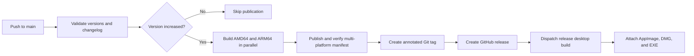

# GitHub Actions

This document describes the MediaLyze GitHub Actions workflows, their automatic triggers, manual controls, published artifacts, and recovery procedures.

## Workflow overview

| Workflow | File | Automatic trigger | Manual trigger | Purpose |
| --- | --- | --- | --- | --- |
| `build and publish Docker images` | `.github/workflows/build-docker.yaml` | Push to `dev` or `main` | Yes | Publish development images or run the official release process |
| `build desktop artifacts` | `.github/workflows/build-desktop.yaml` | Published GitHub release | Yes | Build Linux, macOS, and Windows desktop packages |
| `validate release metadata` | `.github/workflows/validate-release-pr.yaml` | Relevant pull request changes targeting `main` | No | Validate aligned versions and release changelog data |

The former dedicated development Docker and desktop workflow files were consolidated into the two build workflows above. Development and release outputs remain logically isolated even though they share workflow definitions.

## Branch and publication boundaries

| Selected branch | Docker tags | Git tag / GitHub release | Automatic desktop build |
| --- | --- | --- | --- |
| `dev` | `dev` and the calculated `<version>-devNNN` tag | Never | Never |
| `main` with unchanged version | None | None | No |
| `main` with a new valid version | `latest` and `<version>` | Created | Yes |

The Docker workflow rejects refs other than the `dev` and `main` branches. Development and release builds also use separate registry cache tags, so neither channel publishes or replaces the other channel's output.

## Docker images

### Automatic development images

Every push to `dev` starts the Docker workflow.

The workflow:

1. derives the development version from the latest release and the number of commits since that release;
2. builds `linux/amd64` on `ubuntu-latest`;
3. builds `linux/arm64` on `ubuntu-24.04-arm`;
4. publishes both images by digest;
5. combines the digests into one multi-platform manifest;
6. verifies that the published manifest contains both platforms;
7. applies the `dev` and versioned development tags.

Development pushes do not create Git tags, GitHub releases, `latest` images, or desktop packages.

If another commit reaches `dev` while an older Docker run is still active, the older run is canceled. This prevents an obsolete image from being published after a newer commit.

### Official release process

A push to `main` starts the same Docker workflow in release mode.



Before building, release mode validates:

- `ARG APP_VERSION` in the Dockerfile runtime stage;
- `[project].version` in `pyproject.toml`;
- `version` in `frontend/package.json`;
- `version` in `desktop/package.json`;
- the presence of `vUnreleased` in `CHANGELOG.md`;
- a non-empty changelog section for the release version.

All four version values must be identical valid `x.y.z` SemVer values.

If the version did not change compared with the previous `main` commit, the workflow stops without publishing. If the GitHub release already exists, the workflow also skips rebuilding it. A pre-existing Git tag is accepted only when it points to the current release commit; a conflicting tag fails the workflow.

The release tag and GitHub release are created only after both architectures and the combined manifest have been published successfully.

### Manual Docker runs

To start a Docker run manually:

1. open the repository's **Actions** tab;
2. select **build and publish Docker images**;
3. select **Run workflow**;
4. choose either `dev` or `main`;
5. confirm **Run workflow**.

There are no additional inputs. The selected branch determines the complete behavior:

- selecting `dev` publishes a new development image and never starts a desktop build;
- selecting `main` evaluates the official release process;
- selecting any other ref fails intentionally.

Be careful when manually selecting `main`: if its configured version has not been published yet, this run can create the official image, Git tag, GitHub release, and desktop-build dispatch. If the version is unchanged or its GitHub release already exists, publication is skipped.

## Desktop artifacts

### Automatic release builds

Desktop release builds start automatically after the main release workflow creates a GitHub release. The workflow also listens for manually published GitHub releases.

Three jobs run in parallel:

| Runner | Output | Release asset name |
| --- | --- | --- |
| `ubuntu-latest` | Linux AppImage | `MediaLyze.AppImage` |
| `macos-latest` | macOS Apple Silicon disk image | `MediaLyze-arm64.dmg` |
| `windows-latest` | Windows installer | `MediaLyze.Setup.exe` |

Every job builds the frontend, packages the Python backend sidecar, bundles the platform-specific `ffprobe` and `ffmpeg`, creates the installer, and verifies the expected artifact. Windows, macOS, and Linux enumerate the packaged FFmpeg capabilities and run a one-frame encode; Linux additionally repeats the smoke test after extracting the AppImage.

### Manual development desktop build

Development desktop artifacts are intentionally opt-in and are never created by a normal `dev` push.

To build them:

1. open **Actions**;
2. select **build desktop artifacts**;
3. select **Run workflow**;
4. choose the `dev` branch in the workflow branch selector;
5. leave `build_type` set to `dev`;
6. leave `tag_name` and `code_ref` empty;
7. confirm **Run workflow**.

The results are stored on the completed workflow run under **Artifacts**:

- `medialyze-desktop-linux-dev`;
- `medialyze-desktop-macos-dev`;
- `medialyze-desktop-windows-dev`.

They are not attached to a GitHub release.

### Manual release asset build

Use this mode to create or replace desktop assets for an existing GitHub release.

| Input | Required | Meaning |
| --- | --- | --- |
| `build_type` | Yes | Select `release` |
| `tag_name` | Yes for release mode | Existing release tag such as `v0.16.3` |
| `code_ref` | No | Optional source ref used for packaging instead of the release tag |

With `code_ref` empty, the workflow builds the exact release tag. With a value such as `main` or `dev`, the packaging code comes from that ref while the generated assets are uploaded to `tag_name`.

Use `code_ref` only for deliberate packaging-only recovery work. It can produce desktop assets whose build logic differs from the tagged source. Existing assets with the same filenames are replaced using `gh release upload --clobber`.

Release-mode workflow artifacts use these names in addition to the attached release assets:

- `medialyze-desktop-linux-release`;
- `medialyze-desktop-macos-release`;
- `medialyze-desktop-windows-release`.

## Release metadata validation

The `validate release metadata` workflow runs for pull requests targeting `main` when one of these files changes:

- `Dockerfile`;
- `pyproject.toml`;
- `frontend/package.json`;
- `desktop/package.json`;
- `CHANGELOG.md`;
- `.github/scripts/release_metadata.py`.

It runs:

```bash
python3 .github/scripts/release_metadata.py validate
```

The same validation is repeated by the official release workflow. The pull-request check catches most version or changelog mistakes before merging, while the release check protects direct and manual `main` runs.

## Preparing a release

Before merging a release change into `main`:

1. choose the new `x.y.z` version;
2. update the runtime `ARG APP_VERSION` in `Dockerfile`;
3. update `project.version` in `pyproject.toml`;
4. update `version` in `frontend/package.json`;
5. update `version` in `desktop/package.json`;
6. add a non-empty `## vX.Y.Z` section to `CHANGELOG.md`;
7. retain `## vUnreleased` for changes intended for a future release;
8. ensure the release-metadata pull-request check passes.

Do not create the normal release tag manually. The main workflow creates the annotated `vX.Y.Z` tag after the Docker image has been published successfully.

## Caching

Docker builds export separate registry caches for each channel and architecture:

- `buildcache-dev-amd64`;
- `buildcache-dev-arm64`;
- `buildcache-release-amd64`;
- `buildcache-release-arm64`.

The Dockerfile keeps third-party Python dependencies independent from backend source changes and builds architecture-independent frontend and MediaLyze wheel stages on the native build platform.

Desktop jobs use:

- the npm download cache for the frontend and Electron dependencies;
- the pip download cache keyed by `pyproject.toml`;
- an Actions cache for the static Linux `ffprobe`, keyed by its build script.

A restored Linux `ffprobe` is still checked for executability, static linkage, and version output. The final AppImage validation and media smoke test run for both cached and newly built binaries.

Deleting a build cache does not affect published images or desktop releases. The next workflow run simply performs a slower cold build and recreates the cache.

## Failure recovery

### Development Docker build

Push a corrective commit or rerun the failed workflow. A newer `dev` push cancels an obsolete active run automatically.

### Release Docker build before the GitHub release exists

Fix the failure and rerun the workflow from `main`. Already cached layers make the repeat faster. If the annotated tag was already created by an earlier partial run, it is accepted only when it points to the same commit.

### Desktop build failure after a release

First try **Re-run failed jobs** on the original desktop workflow. Alternatively, run **build desktop artifacts** manually with:

- `build_type`: `release`;
- `tag_name`: the existing release tag;
- `code_ref`: empty unless a packaging fix from another ref is intentionally required.

### Existing release needs a new Docker image

The release workflow intentionally does not overwrite an existing official release. Publish a new version for application changes. Desktop-only assets can be rebuilt with the manual desktop release mode described above.

## Permissions and credentials

The workflows use the repository-provided `GITHUB_TOKEN`; no custom publishing token is required.

- Docker publication requires package write access.
- Release finalization requires contents write access.
- Dispatching the desktop workflow requires Actions write access.
- Desktop release uploads require contents write access.
- Pull-request release validation uses contents read access only.

The workflows do not require application runtime secrets, media paths, or production configuration.
